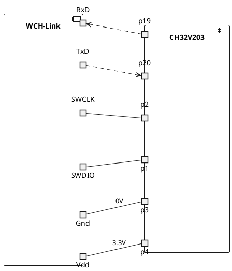

# Mecrisp-Quintus for CH32V203F8P6 chip.

The CH32V203F8P6 is a small-and-medium capacity general-purpose device (V203)
with QingKe V4B core.

This chip is available in a 20-pin (TSSOP20) package. The same core with
specific classification abbreviations by the manufacturer "CH32V20x\_D6", can
be found as well as other surface-mount packages.

This README pertains only to the TSSOP20 package (CH32V203F8P6 chip), and it
has not been tested with other packages. The chip has 64kB of Flash and 20kB of
RAM, operates on 3.3V, has a USB peripheral, 2 ADC, internal fast RC
oscillator, 17 GPIO, and some other peripherals.

## Connections

As of right now, serial interface does not work via USB; a serial adapter must
used - the one from the WCH-Link (see below) or other, FTDI for example.

The connections for the chip are straight forward:-

1. Power. Vdd 3.3V at Pin 4, Gnd at pin 3, can be derived from WCH-Link.
2. Serial interface. This version of Mecrisp uses UART1 (115200 bps), i.e.
   connect RxD to Pin 19 (PA9/TxD) and TxD to pin 20 (PA10/RxD). Gnd to Gnd.
3. The reset. MCLR is raised to VDD with an internal resistor, and can be
   debounced with a small external ceramic capacitor (100 nF).

> See here for the [data sheet](#Links)

### Connection diagram



## Initial flash and boot

Unfortunately in this particular chip the boot mode is hardwired to "boot form flash".
Therefore, to flash the hex file into the chip, you will need a programmer
which is named "WCH-LinkE"[^1].

WCH-Link module can be used for online debugging and downloading of WCH RISC-V
MCU, and also for online debugging and downloading of ARM MCU with SWD/JTAG
interface. It also comes with a serial port which can be used to interact with the device.

Use a simple pin header and connector and connect SWCLK and SWDIO
(pins 2 and 1, respectively) to SWCLK and SWDIO of the WCH-Line header.

[^1]: Although there is an old and chipper version "WCH-Link" the new "WCH-LinkE" is the preferable one.

To flash the chip you have three options:

- the tool that comes from WCH with the WCH-Link,
- the MounRiver Studio (in this case the code can be traced step by step),
- the open source tool, a clone of "Open OCD" recently published by them.

### Flashing with the OpenOCD clone

#### Program

```sh
sudo ./openocd -f wch-riscv.cfg -c init -c halt -c "program mecrisp-quintus-ch32v203f8p6.hex" -c exit
```

#### Erase

```sh
sudo ./openocd -f wch-riscv.cfg -c init -c halt -c "flash erase_sector wch_riscv 0 last" -c exit
```

#### Verify

```sh
sudo ./openocd -f wch-riscv.cfg -c init -c halt -c "verify_image mecrisp-quintus-ch32v203f8p6.hex" -c exit
```

#### Reset

```sh
sudo ./openocd -f wch-riscv.cfg -c init -c halt -c wlink_reset_resume -c exit
```

## FORTH specifics for the "CH32V203F8P6"

The main quirk of this chip is the value of the eased FLASH (see [CH32FV2x_V3xRM.PDF](#links)):

> After erasing is successful, word read - 0xe339e339, half word read - 0xe339, even address byte read -
0x39, odd address read 0xe3.

This comes with the side effect effect that definitions with names of exactly 0x39=57 characters long
may go wrong in subtle ways when compiled to flash and reset before new definitions are compiled
afterwards, as this triggers one of the "end of dictionary" checks.

The memory word access ("@" and "!") should be 4 byte aligned, otherwise an
exception will occur. The same is applicable for the half word access ("H@" and
"H!") - it should be aligned to 2 bytes.

### Design choices

#### FLASH write and erase

The FLASH is programmed in half words (16 bits), the page for erasing is 4k.

#### Serial communication

As it is mentioned above, the serial interface is over UART1 at 115200 bps.

#### Interrupts

All interrupts that do not have their own handler shall be wired into
`irq_collection` which can take as many interrupt sources as you wish.

Also there are also two "fast interrupts" which can skip the vector table, they
are not currently supported.

### Examples and tools

The following files are provided as examples and tools:

- `README.md` - this file, the target specific README file
- `blink.fs`  - example how to use the ports and system counter in order to
  toggle pin PA4 (pin 11) at 100 ms period (preferably connected to the anode
  of a LED thought 0.1-1 kOhm resistor. The cathode of the LED is wired to the
  ground).
- `hdump.fs`  - program that dumps the altered part of the whole FLASH into INTEL-HEX format
- `helper.fs` - yet another dump
- `quintusemu-ch32v203.pas` - software simulator for the CH32V203F8P6 chip
- `systick.fs` - an example how to connect ISR (FORTH word) to the system clock timer
- `uploader.py` - handy tool to upload file(s) to the mecrisp-quintus and
  execute code before or/and after that. Supports "reset" and `compiletoflash`
  options. The timing is tunable with the `-t` option, for me, it works better in the
  range of `-t 0.1` to `-t 0.01`. Its main advantage is that it stops if no "ok." was returned.

## Links

CH32V203 Datasheet: [CH32V20x_30xDS0.PDF](http://www.wch-ic.com/downloads/CH32V20x_30xDS0_PDF.html)

CH32V203 Reference Manual: [CH32FV2x_V3xRM.PDF](http://www.wch-ic.com/downloads/CH32FV2x_V3xRM_PDF.html)

WCH-Link usage instructions: [WCH-LINK](http://www.wch-ic.com/products/WCH-Link.html)

OpenOCD for CH32V series MCUs: [OpenOCD](https://github.com/kprasadvnsi/riscv-openocd-wch)

MounRiver’s free CH32V flashing tool: [MounRiver’s site](http://mounriver.com/)

WCH-Link command line tool - [wlink](https://github.com/ch32-rs/wlink)


